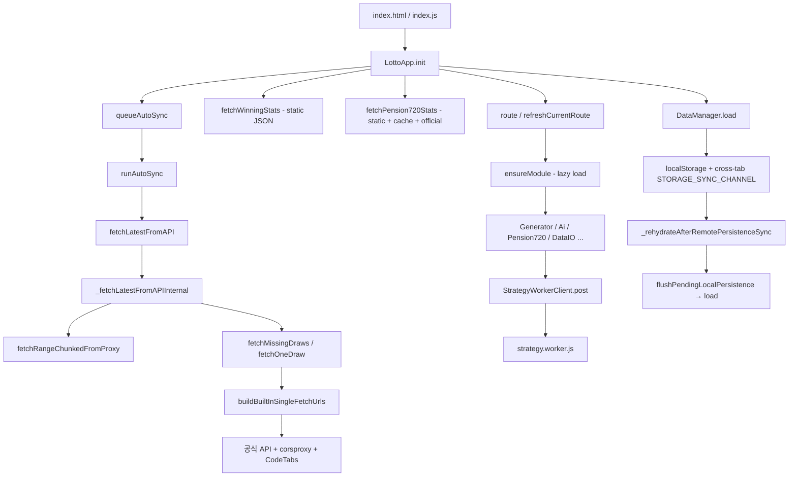

# Project Audit

감사 일자: 2026-07-02  
대상: `lotto-pension-pro-webapp` (로또·연금복권 프로)  
방법: `README.md`, `Claude.md` 검토 → CodeGraph MCP 구조/호출 관계 분석 → 보조 grep·파일 열람·`node scripts/smoke/smoke.mjs` 실행

---

## 1. Executive Summary

전체 위험도: **Medium** (기능은 대체로 견고하나, **브라우저 런타임의 동행복권 공식 API 접근**이 구조적 취약점)

이 프로젝트는 no-build 정적 SPA로, `DataManager` 중심의 상태/영속화, `StrategyWorkerClient` 기반 무거운 연산 오프로딩, smoke 회귀(130건+)로 핵심 경로가 잘 방어되어 있습니다. `node scripts/smoke/smoke.mjs`는 **전체 PASS**였습니다.

다만 실사용에서 가장 큰 기능 리스크는 다음입니다.

1. **동행복권 공식 API는 브라우저에서 CORS로 직접 호출이 불가**한데, 로또 동기화는 서드파티 CORS 프록시(`corsproxy.io`, `CodeTabs`)에 의존하고, 연금복권720+는 브라우저에서 공식 URL 직접 fetch만 시도합니다.
2. **README의 “프록시 없이도 기본 자동 동기화”** 설명은 기술적으로 맞지만, 실제로는 외부 CORS 중계 가용성에 크게 좌우됩니다.
3. **URL 쿼리(`?proxyUrl=`)로 데이터 연결 주소가 우선 적용**되어, 공유 링크 경유 시 의도치 않은 프록시 주입 가능성이 있습니다.

Critical 수준의 즉시 데이터 손상/보안 취약점은 smoke·정규화·덮어쓰기 백업 흐름 덕분에 **현재 코드에서 확인되지 않았습니다**. High/Medium 이슈는 주로 **외부 API·프록시 의존**, **비동기 경합**, **문서-구현 간격**에 집중됩니다.

---

## 2. Project Understanding

### 2.1 프로젝트 목적

- 동행복권 **로또 6/45**·**연금복권720+** 당첨 통계 기반 번호 생성·추천·저장·당첨 확인·백업/복원 PWA
- 사용자 데이터는 **브라우저 localStorage** (+ sessionStorage 임시 결과)
- 당첨 통계는 **번들 정적 JSON** + 런타임 동기화/캐시

### 2.2 아키텍처 개요

| 계층 | 경로 | 역할 |
|------|------|------|
| 엔트리 | `index.html` → `assets/modules/index.js` | PWA 등록, `LottoApp` 부트 |
| 앱 코어 | `assets/modules/core/LottoApp.js` | 라우팅, 자동 동기화, 크로스탭, 모듈 로딩 |
| 상태/영속화 | `assets/modules/core/DataManager.js` + `data/persistence/*` | load/save, dirty flush, cross-tab broadcast |
| 데이터 동기화 | `assets/modules/core/data/sync/orchestrator.js` | `fetchWinningStats`, `fetchLatestFromAPI` |
| 연금복권 | `data/pension720/stats.js`, `Pension720Engine`, `features/pension720/*` | 통계 로드·추천·당첨 확인 |
| 무거운 연산 | `StrategyWorkerClient` → `strategy.worker.js` | 생성/추천 워커 |
| 기능 UI | `assets/modules/features/*` | Generator, Ai, Check, DataIO, Backtest 등 |
| 프록시(선택) | `proxy/worker.js` | Cloudflare Worker로 동행복권 API CORS 우회 |
| 검증 | `scripts/smoke/smoke.mjs` + CI 스크립트 | 정규화·동기화·import·PWA 회귀 |

### 2.3 주요 실행 흐름 (CodeGraph 기준)



### 2.4 동행복권 API 연동 구조 (실제 반영 사항)

| 게임 | 공식 엔드포인트 (코드 기준) | 정규화 필드 | 브라우저 직접 호출 |
|------|---------------------------|------------|-------------------|
| 로또 6/45 | `https://www.dhlottery.co.kr/lt645/selectPstLt645Info.do?srchLtEpsd={회차}` | `ltEpsd`, `tm1WnNo`~`tm6WnNo`, `bnsWnNo`, `ltRflYmd` ↔ `draw_no`, `numbers`, `bonus`, `date` | CORS 차단 → 프록시/서드파티 필요 |
| 연금720+ | `https://www.dhlottery.co.kr/pt720/selectPstPt720WnList.do` | `psltEpsd`, `wnBndNo`, `wnRnkVl`, `bnsRnkVl`, `psltRflYmd` | CORS 차단 → 브라우저 런타임 공식 갱신 사실상 실패 가능 |
| QR 스캔 | `m.dhlottery.co.kr` / `www.dhlottery.co.kr` `?v=` 파라미터 | `QrScanner.parseLottoQr` | 로컬 파싱만 (API 호출 없음) |

레거시 `common.do?method=getLottoNumber` 경로는 **사용하지 않음**. `selectPstLt645Info.do` / `selectPstPt720WnList.do`로 정렬되어 있으며, `parseSyncPayload`·`extractOfficialList`가 복수 응답 형태를 방어적으로 처리합니다.

### 2.5 문서 vs 구현 정합성

| 항목 | 문서 | 구현 | 판정 |
|------|------|------|------|
| SW 캐시 버전 `v30` | Claude.md | `sw.js` `CACHE_VERSION = 'v30'` | 일치 |
| 백업 스키마 v5, 32MB import | README / Claude.md | `backup.js`, `config.js` `MAX_IMPORT_BYTES` | 일치 |
| 프록시 없이 기본 동기화 | README | `buildBuiltInSingleFetchUrls`가 서드파티 CORS 프록시 사용 | **부분 불일치** (아래 High 이슈) |
| 연금복권 공식 캐시 | Claude.md | `lotto_pro_pension720_stats_cache_v1` | 일치 |
| 탭 명칭 “번호 추천” | README | `Ai.js` / `ai` 라우트 (레거시 AI 명칭 회피) | 일치 |

---

## 3. High-Risk Issues

### 3.1 브라우저에서 연금복권720+ 공식 API 직접 fetch — CORS 구조적 실패

* **위치:** `assets/modules/core/data/pension720/stats.js` — `fetchPension720Stats`, `PENSION720_OFFICIAL_LIST_URL`
* **문제:** 브라우저에서 동행복권 `selectPstPt720WnList.do`를 `fetch`로 직접 호출합니다. 동행복권 사이트는 GitHub Pages 오리진에 CORS를 허용하지 않아, 런타임 공식 갱신은 대부분 실패하고 정적 JSON·`official_cache`에 의존합니다.
* **영향:** 사용자가 “최신 연금복권 데이터 확인”을 눌러도 공식 소스 반영이 안 되고, 정적 배포·로컬 캐시가 오래되면 추천/당첨 확인 기준 회차가 뒤처질 수 있습니다. 로또와 달리 **전용 Cloudflare 프록시 경로가 없습니다**.
* **근거:**

```4:4:assets/modules/core/data/pension720/stats.js
const PENSION720_OFFICIAL_LIST_URL = 'https://www.dhlottery.co.kr/pt720/selectPstPt720WnList.do';
```

```92:116:assets/modules/core/data/pension720/stats.js
        if (useRemote) {
            try {
                const res = await this.fetchWithTimeout(
                    PENSION720_OFFICIAL_LIST_URL,
                    { cache: 'no-cache', headers: { Accept: 'application/json' } },
                    7000
                );
                // ...
            } catch (error) {
                console.warn('연금복권 공식 데이터 조회 실패', error);
            }
        }
```

  로또는 `assets/modules/core/data/sync/providers.js`에서 공식 URL + `corsproxy.io` + `CodeTabs` 폴백이 있으나, 연금720+에는 동등한 경로가 없습니다.

* **권장 수정 방향:**
  1. `proxy/worker.js`에 연금720+ 목록/단건 엔드포인트 추가 (`/proxy/pension720/latest` 등)
  2. 또는 로또와 동일하게 검증된 CORS 중계 후보 + 사용자 프록시 설정을 `fetchPension720Stats`에 연결
  3. 실패 시 UI에 “공식 실시간 갱신 불가, 정적/캐시 사용 중”을 데이터 헬스에 명시
* **우선순위:** **High**

---

### 3.2 로또 기본 자동 동기화의 서드파티 CORS 프록시 의존

* **위치:** `assets/modules/core/data/sync/providers.js` — `BUILTIN_SYNC_SINGLE_PROVIDERS`, `buildBuiltInSingleFetchUrls`
* **문제:** 커스텀 Worker 프록시가 없을 때 공식 API 직접 호출(브라우저 CORS 실패) 후 `corsproxy.io`, `api.codetabs.com`으로 우회합니다. 이는 동행복권이 아닌 **제3자 인프라**에 당첨번호 요청이 노출됩니다.
* **영향:**
  - 프록시 장애/차단 시 `SYNC_NO_UPDATE_STALE`로 동기화 실패 (smoke `runAutoSyncFallbackRegression`이 이 경로 검증)
  - 개인정보는 최소이나 **요청 메타데이터·회차 정보가 제3자에 전달**
  - README “설정하지 않아도 기본 자동 동기화”와 사용자 기대 간 괴리
* **근거:**

```3:22:assets/modules/core/data/sync/providers.js
const BUILTIN_SYNC_SINGLE_PROVIDERS = [
    { label: '공식 API', buildUrl(targetUrl) { return targetUrl; } },
    { label: 'corsproxy.io', buildUrl(targetUrl) {
        return `https://corsproxy.io/?${encodeURIComponent(targetUrl)}`;
    }},
    { label: 'CodeTabs', buildUrl(targetUrl) {
        return `https://api.codetabs.com/v1/proxy/?quest=${encodeURIComponent(targetUrl)}`;
    }}
];
```

* **권장 수정 방향:**
  - README/설정 UI에 “기본 동기화 = 공식 API + 공개 CORS 중계 시도”를 명시
  - 장기적으로 앱 기본 제공 Worker(또는 동행복권 허용 프록시)를 1차 경로로 승격
  - 서드파티 프록시 응답 형식 변화 감지·사용자 경고 강화 (`SYNC_FETCH_ONE_INVALID_PAYLOAD` 활용)
* **우선순위:** **High**

---

### 3.3 URL 쿼리 파라미터로 데이터 연결 주소 우선 적용

* **위치:** `assets/modules/core/data/persistence/proxy.js` — `getQueryProxyUrl`, `resolveProxyConfig`
* **문제:** `?proxyUrl=` / `?proxy=`가 저장 설정보다 **우선** 적용됩니다. 검증은 `/proxy/latest` 형식만 허용하지만, 공유 링크·피싱 페이지로 악의적 프록시를 주입할 수 있습니다.
* **영향:** 악의적 프록시가 조작된 당첨 데이터를 반환하면 당첨 확인·동기화 결과가 왜곡될 수 있습니다 (로컬 저장 데이터 자체는 직접 변조하지 않으나 **신뢰하는 최신 회차**가 오염될 수 있음).
* **근거:**

```85:106:assets/modules/core/data/persistence/proxy.js
    getQueryProxyUrl() {
        const params = new URLSearchParams(window.location.search);
        const proxyUrl = (params.get('proxyUrl') || '').trim();
        if (proxyUrl) return this.buildProxyConfig('URL 쿼리(proxyUrl)', proxyUrl);
        // ...
    },
    resolveProxyConfig() {
        const queryProxy = this.getQueryProxyUrl();
        if (queryProxy) return queryProxy;
        // saved settings는 그 다음
```

* **권장 수정 방향:**
  - 쿼리 프록시 적용 시 **명시적 사용자 확인** 토스트/모달
  - 또는 설정에서 “URL 파라미터 프록시 허용” 옵트인
  - 적용된 프록시 호스트를 설정 패널에 항상 표시
* **우선순위:** **Medium** (악용 시나리오는 있으나 `/proxy/latest` 검증으로 완화)

---

### 3.4 StrategyWorkerClient 동시 다중 요청 직렬화 부재

* **위치:** `assets/modules/core/StrategyWorkerClient.js` — `post`, `postOnce`, `pending` Map
* **문제:** `pending` Map은 요청 ID별 추적만 하고, **동시 GENERATE + RECOMMEND** 등 복수 워커 작업을 직렬화하지 않습니다. `resetWorker()`는 한 요청 타임아웃 시 워커 전체를 terminate하여 **다른 진행 중 요청도 함께 실패**할 수 있습니다.
* **영향:** 사용자가 번호 생성·추천·백테스트를 빠르게 연속 실행하면 워커 재시작·타임아웃 연쇄, UI 일시 정지 가능. Ai/Generator는 `runToken`/`isRecommending`으로 UI 중복은 막지만 **워커 레벨 경합**은 남습니다.
* **근거:**

```201:232:assets/modules/core/StrategyWorkerClient.js
    async post(type, payload, timeoutMs = null, retries = MAX_RETRY) {
        // ...
        if (isTimeout && attempt < retries) {
            this.resetWorker();  // 전체 워커 terminate
            attempt++;
            continue;
        }
```

  CodeGraph blast radius: `StrategyWorkerClient` — covering tests **없음** (smoke는 postMessage cleanup·cache-empty retry만 검증).

* **권장 수정 방향:**
  - 워커 요청 큐(단일 in-flight) 또는 타입별 세마포어
  - `resetWorker` 전 다른 `pending` 요청에 취소/재시도 정책 명확화
* **우선순위:** **Medium**

---

### 3.5 import 가져오기 중복 실행 가능 (확인 대화상자 대기 구간)

* **위치:** `assets/modules/features/dataio/importFlow.js` — `importAll`
* **문제:** `isImporting` 같은 in-flight 가드가 없습니다. 파일 선택 → `confirmPreparedImport` 대기 중 또 다른 import를 시작할 수 있습니다.
* **영향:** 덮어쓰기 모드에서 백업·적용 순서가 꼬이거나, 상태가 예측 불가하게 병합될 수 있습니다 (확률은 낮으나 기능적으로 가능).
* **근거:** `importAll`은 `file.size` 검증·`JSON.parse`·confirm 후 `applyPreparedImport`까지 async이나, 진행 중 플래그 없음. grep `isImporting` — **매칭 없음**.

* **권장 수정 방향:** `importInFlight` 플래그 + 버튼/input disabled until `finally`
* **우선순위:** **Low**

---

### 3.6 localStorage 쿼터 초과 시 부분 저장 상태

* **위치:** `assets/modules/core/data/persistence/storage.js` — `_safeSetItem`; `loadSave.js` — dirty tracking
* **문제:** 키별 dirty write 실패 시 `markAllDirty`로 재시도는 하지만, **일부 키만 저장 성공**한 상태가 지속될 수 있습니다. 크로스탭 rehydrate는 flush 실패 시 원격 로드를 보류합니다 (양호).
* **영향:** 대용량 티켓·캠페인 보유 사용자에서 저장 실패 후 탭 전환·새로고침 시 **일부 데이터만 반영**될 수 있음.
* **근거:**

```119:141:assets/modules/core/data/persistence/storage.js
    _safeSetItem(key, value, options = {}) {
        try {
            localStorage.setItem(key, value);
            return true;
        } catch (e) {
            if (e.name === 'QuotaExceededError' || e.name === 'NS_ERROR_DOM_QUOTA_REACHED') {
                UIManager.toast('저장 공간이 가득 찼습니다. 데이터를 정리해 주세요.', 'error');
            }
            return false;
        }
    }
```

  smoke: `storage dirty-retained-on-failure`, `remote rehydrate persistence-flush` PASS.

* **권장 수정 방향:** 저장 실패 시 설정 패널·데이터 관리에 **영속 실패 배너** 상시 표시; 자동 백업 권고
* **우선순위:** **Medium**

---

### 3.7 동행복권 API 응답 래핑 형식 변화에 대한 런타임 취약성

* **위치:** `assets/modules/core/data/sync/payload.js` — `parseSyncPayload`, `extractSingleDrawFromPayload`; `proxy/worker.js` — `getOneDraw`
* **문제:** 정규화는 `ltEpsd`/`draw_no` 등 **듀얼 필드**를 지원하나, Worker 프록시는 `parsed?.data?.list[0]` 고정 구조에 의존합니다. 서드파티 CORS 프록시가 HTML/Markdown 래핑을 붙이면 `parseSyncPayload`의 휴리스틱에 의존합니다.
* **영향:** 동행복권 또는 중계 서비스 응답 형식 변경 시 **단건/범위 동기화 전면 실패** 가능. CI `check:lotto:official`·`check:pension720:freshness`는 Node fetch로 조기 감지 가능.
* **근거:** `parseSyncPayload`는 `Title:`/`Markdown Content:` 분리, `contents` 이중 파싱 등 방어 로직 존재. `proxy/worker.js` `getOneDraw`는 `data.list` 단일 경로.

* **권장 수정 방향:**
  - Worker·클라이언트가 동일한 `extractSingleDrawFromPayload` 공유
  - 공식 API 스키마 변경 시 smoke에 **fixture 기반 회귀** 추가
* **우선순위:** **Medium**

---

## 4. Potential Functional Gaps

### 확인된 갭 (코드/문서 근거 있음)

| 갭 | 설명 |
|----|------|
| 연금720+ 브라우저 실시간 공식 동기화 | 로또 대비 프록시·폴백 체인 부재 (§3.1) |
| 기본 로또 동기화의 제3자 의존 | 사용자 문서에 투명하게 설명되지 않음 (§3.2) |
| 기기 간 자동 동기화 | README FAQ에서 명시적으로 미지원 — 의도된 제한 |
| `importAll` 진행 중 재진입 가드 | 없음 (§3.5) |

### 추정 갭

| 갭 | 설명 |
|----|------|
| **추정:** 동행복권 rate limit | `FALLBACK_FETCH_CONCURRENCY=3`, proxy `RANGE_CONCURRENCY=4`로 대량 누락 회차 보정 시 공식/중계 차단 가능. 장기 미사용 후 첫 동기화에서 간헐 실패 가능. |
| **추정:** iOS Safari PWA localStorage 상한 | `_checkStorageQuotaWarning` 존재하나 iOS WebKit 특유의 조기 eviction 시 사용자 안내 부족 가능. |
| **추정:** 추첨 직후~공식 게시 전 “estimated latest” 구간 | `estimateLatestDrawKST` 기반 추정과 공식 미게시 시 `defer` 로직은 CI에 있으나, 브라우저 UI에서 “아직 미발표”와 “동기화 실패” 구분이 사용자에게 모호할 수 있음. |
| **추정:** 연금720+ 당첨 확인의 대상 회차 자동 선택 | README는 “대상 회차 우선·최신 fallback”을 설명. 구현은 `pension720/checks.js`에 있으나, 정적 데이터가 오래된 경우 UX 혼란 가능. |

### 잘 구현된 방어 (감사에서 긍정 확인)

- 로또 동기화 in-flight dedup·abort·proxy fingerprint 변경 시 재시작 (`orchestrator.js` `fetchLatestFromAPI`)
- 크로스탭 `flushPendingLocalPersistence` → `load` 순서 (`networkLifecycle.js`, smoke PASS)
- import 덮어쓰기 전 자동 백업 + 확인 (`importFlow.js`, `backupExport.js`)
- 백업/티켓/연금 정규화·한도 (`backup.js`, `CONFIG.LIMITS`)
- CSV 수식 injection 방지 (smoke `pension720 CSV formula escape`)
- QR 호스트 화이트리스트 (`QrScanner.parseLottoQr`)
- 라우트 `routeToken` stale 방지 (`moduleLoader/routing.js`)
- Ai/Generator/Pension720 `runToken`·`isRecommending` UI 중복 방지

---

## 5. Recommended Fix Plan

### 1단계 — 즉시 (기능 신뢰도·사용자 피해 방지)

1. **연금720+ 런타임 공식 갱신 경로 추가** — Worker 프록시 또는 검증된 CORS 폴백을 로또와 대칭 구현 (§3.1)
2. **README/설정 UI 문구 정정** — “기본 자동 동기화”가 서드파티 CORS 중계에 의존할 수 있음을 명시; Cloudflare Worker 배포 권장 강조 (§3.2)
3. **URL 쿼리 프록시 적용 시 사용자 확인** (§3.3)

### 2단계 — 안정성 개선

4. `StrategyWorkerClient` 요청 큐·워커 reset 시 pending 정리 (§3.4)
5. `importAll` in-flight 가드 (§3.5)
6. localStorage 저장 실패 **지속 배너** + 데이터 관리 탭 연동 (§3.6)
7. Worker·클라이언트 payload 추출 로직 통합 및 공식 API fixture 회귀 (§3.7)

### 3단계 — 구조 개선

8. 연금720+·로또 공통 **DataSource 추상화** (static / official_cache / proxy / third_party)
9. 동기화·공식 fetch **가용성 메트릭**을 설정 패널에 노출 (마지막 성공 소스, 실패 사유)
10. 브라우저 Playwright canary를 CI 필수 게이트에 더 가깝게 통합 (`test:sync-live:browser:official`)

---

## 6. Test Recommendations

현재 smoke **130건+ PASS**로 정규화·동기화 가드·import·PWA·innerHTML 감사가 잘 갖춰져 있습니다. 아래는 **추가·보강** 권장입니다.

### 6.1 동행복권 / 프록시 연동

| 테스트 | 내용 |
|--------|------|
| `pension720-browser-official-fetch-fallback` | 브라우저 환경 mock에서 CORS `TypeError` 시 static+cache 유지, `dataHealth.source` 메시지 검증 |
| `pension720-proxy-parity` | (구현 후) Worker `/proxy/pension720` 응답이 `normalizePension720Draw`와 일치 |
| `third-party-proxy-shape-regression` | corsproxy/CodeTabs가 Markdown/HTML 래핑 응답을 줄 때 `parseSyncPayload` 성공/실패 케이스 |
| `official-api-field-alias` | `ltEpsd` vs `draw_no`, `psltEpsd` vs `draw_no` 혼합 fixture |

### 6.2 비동기 / race condition

| 테스트 | 내용 |
|--------|------|
| `strategy-worker-concurrent-generate-recommend` | GENERATE 진행 중 RECOMMEND 시 한쪽 취소/완료 정책 검증 |
| `import-all-double-submit` | confirm 대기 중 두 번째 `importAll` 호출 차단 |
| `auto-sync-during-manual-sync` | 동일 proxy fingerprint에서 promise 공유, 다른 fingerprint에서 abort 후 재시작 (smoke 일부 존재 — 브라우저 E2E 보강) |

### 6.3 보안 / 입력

| 테스트 | 내용 |
|--------|------|
| `query-proxy-confirmation` | `?proxyUrl=` 적용 시 확인 UI 필요 (구현 후) |
| `malicious-proxy-tampered-draw` | 조작 JSON 반환 프록시에서 `normalizeDrawItem` 거부·경고 |

### 6.4 영속화 / OS 호환

| 테스트 | 내용 |
|--------|------|
| `localStorage-partial-failure-ui` | 일부 키만 `_safeSetItem` 실패 시 dirty·배너 상태 |
| `import-32mb-near-limit-memory` | 32MB 근접 JSON parse·preview 성능 (Node smoke 확장) |

### 6.5 문서 / CI 정합

| 테스트 | 내용 |
|--------|------|
| 기존 `check:docs-data-baseline` 유지 | README·Claude.md 최신 회차와 `data/*.json` 동기 |
| `npm run test:sync-live:browser:official` | 릴리스 전 수동·주간 canary (이미 workflow 존재) — 연금720+ 경로 추가 권장 |

---

## 부록: 검증 실행 기록

| 명령 | 결과 |
|------|------|
| `node scripts/smoke/smoke.mjs` | **PASS** (전체 회귀, 2026-07-02 실행) |
| CodeGraph MCP | 엔트리·동기화·import·워커·라우팅 호출 관계 분석 완료 |

---

## 7. Implementation Status (2026-07-02)

감사 권장 수정안 1~3단계 및 §6 핵심 회귀 테스트를 코드에 반영했습니다.

| 권장 항목 | 상태 | 주요 변경 |
|-----------|------|-----------|
| §3.1 연금720 공식 갱신 경로 | ✅ | `remoteFetch.js`, `builtinProviders.js`, Worker `/proxy/pension720/list` |
| §3.2 서드파티 CORS 안내 | ✅ | `README.md`, `index.html`, `settingsPanel.js` |
| §3.3 URL 쿼리 프록시 확인 | ✅ | `proxy.js` `ensureQueryProxyAcknowledged()` |
| §3.4 워커 요청 직렬화 | ✅ | `StrategyWorkerClient._dispatchChain` |
| §3.5 import in-flight 가드 | ✅ | `DataIO.js`, `importFlow.js` |
| §3.6 저장 실패 배너 | ✅ | `storageFailureBanner`, `networkLifecycle.js` |
| §3.7 payload 추출 통합 | ✅ | `sync/lottoPayloadCore.js` — 클라이언트·Worker 공유 |
| 3단계 DataSource 추상화 | ✅ | `data/dataSource.js` |
| 3단계 가용성 메트릭 | ✅ | `syncMeta.pension720`, 설정 패널 연금 메트릭 |
| 3단계 Playwright canary | ✅ | `live_data_source_playwright.mjs` 연금720·syncMeta 검증 |
| §6 audit 회귀 | ✅ | `regressions/auditFixes.mjs` 12건 |

**검증:** `node scripts/smoke/smoke.mjs` PASS · `npm run lint` PASS · `npm run build:release` PASS

**PWA:** `CACHE_VERSION` `v31`

**남은 선택 과제:** import 32MB 근접 성능 smoke, 브라우저 CORS mock 전용 E2E, 악의적 프록시 full Playwright E2E

*초기 감사 본문은 2026-07-02 기준 스냅샷입니다. 추정 항목은 본문에서 “추정”으로 표기했습니다.*