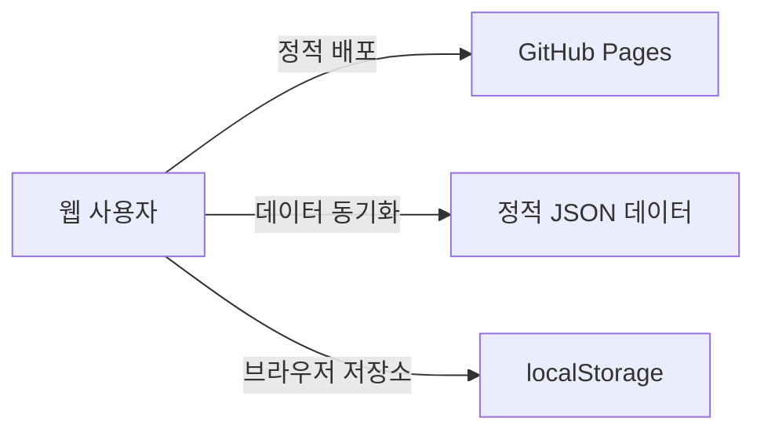

# 로또 6/45 프로 웹앱

이 프로젝트는 동행복권 당첨 정보를 조회, 분석하고 번호를 생성하는 웹앱입니다.
기존 파이썬 데스크톱 앱을 단일 페이지 웹앱으로 전환한 버전입니다.

## 배포 주소

- GitHub Pages: https://twbeatles.github.io/lotto---webapp/

## 기능 구현 정합성 2차 보강 반영 (2026-04-05)

- **티켓 정산 재정합성 추가** (`analytics.js`, `sync.js`, `dataio/postImportRefresh.js`)
  - `reconcileTicketChecks()` 를 추가해 현재 `winningStats` 기준으로 전체 티켓의 `checked` 상태를 다시 계산합니다.
  - 결과가 없는 회차이거나 최신 당첨 데이터가 아직 해당 티켓 회차에 도달하지 않았으면 `checked` 를 제거하고 `pending` 으로 되돌립니다.
  - 이 재정합성은 앱 초기 로드, 최신 회차 동기화 직후, Import 후 post-refresh, 로컬 업데이트 정리 후 재적재 경로에서 공통 적용됩니다.
- **로컬 업데이트 방어 및 sync 메타 clamp** (`persistence.js`, `sync.js`)
  - `sanitizeLocalUpdates()` 로 로컬 업데이트 정규화, 회차 중복 제거, 정렬, 미래 회차 방어를 중앙화했습니다.
  - 허용 상한은 `estimateLatestDrawKST() + 2` 이며, 이를 넘는 미래 회차 항목은 저장하지 않고 제외합니다.
  - `syncMeta.lastSuccessDrawNo` 는 실제 유효 최신 회차보다 높게 남지 않도록 `winningStats` 재구성 직후 clamp 됩니다.
- **캠페인 orphan 자동 정리 확대** (`records.js`, `dataLists.js`, `dataio/importExport.js`)
  - `pruneOrphanCampaigns()` 공용 로직을 도입해 Merge/Overwrite Import 뿐 아니라 개별 티켓 삭제와 전체 티켓 정리 후에도 orphan campaign 이 자동 삭제됩니다.
  - 삭제/정리 완료 toast 에는 자동 정리된 캠페인 수가 함께 표시됩니다.
- **히스토리 정책을 actual-log 기준으로 변경** (`records.js`, `generator/actions.js`, `dataio/importExport.js`)
  - `favorites` 는 기존대로 번호 조합 unique 정책을 유지합니다.
  - `history` 는 이제 같은 번호라도 생성/저장된 횟수만큼 모두 남기며, Import merge 도 날짜 내림차순 actual-log 기준으로 합칩니다.
- **스모크 테스트 회귀 추가** (`scripts/smoke/`)
  - `ticket-reconcile`
  - `future local-updates guard`
  - `clear-local-updates reconcile`
  - `orphan-campaign auto-cleanup`
  - `history actual-log`

## UI/UX 1차 개선 반영 (2026-03-27)

- **공통 UX 인프라 정리** (`UIManager.js`, `settingsPanel.js`, `index.html`, `strings.js`)
  - 공용 `confirm/prompt` 모달을 추가하고 삭제/덮어쓰기 흐름을 네이티브 `confirm()`/`prompt()` 대신 일관된 UI로 통합했습니다.
  - 모달 최초 포커스, `Tab`/`Shift+Tab` 포커스 트랩, `Escape` 닫기, 호출 버튼 포커스 복귀를 공통 처리합니다.
  - 사용자 노출 문구를 `assets/modules/utils/strings.js`로 분리해 토스트/상태/버튼 라벨의 한글 일관성을 높였습니다.
  - 번호 공 렌더링과 주요 스테퍼 버튼에 `aria-label`을 추가했고, viewport 줌 제한을 제거했습니다.
- **생성/캠페인/시뮬레이션 안정성 보강** (`features/generator/*`, `features/backtest/*`)
  - 생성/캠페인 실행 중 버튼 비활성화와 스피너 상태를 추가하고, 요청 토큰으로 늦게 끝난 응답이 최신 결과를 덮지 않도록 막았습니다.
  - 시뮬레이션 결과는 탭 재진입 후에도 유지되며, 요약 카드에 ROI/적중률/총상금 미니 차트를 추가했습니다.
- **당첨 확인 탭 재설계** (`Check.js`, `index.html`, `assets/styles/*`)
  - 네이티브 `select size="10"`을 카드형 리스트로 교체했습니다.
  - 검색, 소스 탭, 티켓 상태 필터, 키보드 탐색, 스캔 결과 고정 노출, 모바일 단일 컬럼 흐름을 지원합니다.
- **모바일 내비/설치 CTA 정리** (`LottoApp.js`, `index.html`, `assets/styles/responsive.css`)
  - 모바일 하단 내비를 `생성/통계/예측/확인/데이터 + 더보기` 구조로 단순화했습니다.
  - `더보기` 바텀시트에서 `시뮬레이션`, `설정`, `앱 설치`에 접근할 수 있습니다.
  - PWA 설치 버튼은 데스크톱 사이드바뿐 아니라 설정 모달과 모바일 `더보기`에도 동기화됩니다.

## 기능 정합성 후속 보강 반영 (2026-03-25)

- **티켓 저장 직후 정합성 보강** (`records.js`)
  - 과거 회차 티켓은 저장 직후 현재 보유한 당첨 데이터 기준으로 즉시 정산됩니다.
  - 미래 회차 티켓만 `pending` 상태를 유지합니다.
- **생성 탭 목표 회차 자동추적 복구** (`generator/form.js`, `LottoApp.js`)
  - 생성 탭의 캠페인 초기화가 단순 값 리셋이 아니라 자동 추적 메타데이터까지 복구합니다.
  - 초기화 후 최신 회차가 바뀌면 `genTargetDrawNo`, `campStartDraw` 가 다시 다음 회차를 따라갑니다.
- **Import 후 orphan campaign 정리** (`dataio/support.js`, `dataio/importExport.js`)
  - Merge/Overwrite Import 후 연결 티켓이 없는 캠페인은 자동 정리됩니다.
  - Import 결과 toast 에 cleanup 수치가 함께 표시됩니다.
- **스모크 테스트 회귀 추가** (`scripts/smoke/`)
  - `immediate ticket settlement`
  - `campaign reset autofill recovery`
  - `import orphan-campaign cleanup`

## AI 예측 다양화·자동선택 반영 (2026-03-21)

- **전략 다양화** (`StrategyCatalog.js`, `core/strategy/*`)
  - 신규 전략 `consensus_portfolio`, `bayesian_smooth`, `momentum_recent`, `mean_reversion_cycle` 를 추가했습니다.
  - AI 탭 전용 자동 전략 `auto_recent_top`, `auto_ensemble_top3` 를 추가했습니다.
- **자동 추천 로직 강화** (`weights.js`, `generation.js`, `evaluation.js`)
  - 최근 `N회` 성능을 다시 측정해 상위 전략 1개를 자동 선택하거나, 상위 3개 전략의 현재 가중치를 혼합하는 방식이 동작합니다.
  - `aiLookbackWindow` 입력값이 자동 전략의 최근 평가 범위로도 사용됩니다.
  - 추천 단계는 단순 샘플링만 하지 않고, 후보풀을 만든 뒤 세트 점수 기반으로 리랭킹하고 유사 조합을 분산합니다.
- **설명 가능성 강화** (`features/ai/rendering.js`)
  - AI 로그에 `리랭킹 후보풀`, `최고 추천 점수`, `최근 N회 자동 비교`, `자동 선택 결과`를 표시합니다.
  - 추천 카드 상세에 `추천 점수`, `페어 시너지`, `프로파일 적합도`, `공백 균형`, 번호별 `추세/회귀/베이즈` 신호를 표시합니다.
- **AI 평가 스크립트 추가** (`scripts/perf/ai_eval.mjs`, `package.json`)
  - `npm run bench:ai` 로 최근 회차 구간에 대한 전략별 AI 추천 회귀평가를 실행할 수 있습니다.
  - 최근 20회 단기 검증 기준으로 `auto_ensemble_top3` 가 `4개 이상 적중 draw 비율`에서 경쟁력 있는 결과를 보였습니다.

## 기능 정합성·운영 진단 강화 반영 (2026-03-19)

- **목표 회차 기본값 자동 관리** (`LottoApp.js`, `latestDraw.js`, `index.html`)
  - `genTargetDrawNo`, `campStartDraw`, `aiTargetDrawNo`는 사용자가 직접 수정하지 않은 경우 최신 회차 기준 다음 회차로 자동 갱신됩니다.
  - 각 입력에는 `다음 회차로 재설정` 버튼을 추가했습니다.
- **비동기 라우트 stale guard 보강** (`moduleLoader.js`)
  - `refreshCurrentRoute()` 에 현재 라우트 토큰 체크를 추가해 동기화 직후 빠른 탭 전환 시 이전 탭 렌더가 뒤늦게 섞이는 문제를 막았습니다.
- **단건 동기화 payload 진단 강화** (`sync.js`, `settingsPanel.js`, `index.html`)
  - `fetchOneDraw()` 가 예상 외 JSON 구조를 받으면 `SYNC_FETCH_ONE_INVALID_PAYLOAD` 로그를 남깁니다.
  - 설정 모달에 최근 응답 구조 경고(`syncMeta.lastWarningMessage`)를 표시합니다.
- **로컬 업데이트 관리 보강** (`config.js`, `persistence.js`, `dataLists.js`, `index.html`)
  - `lotto_pro_updates_v2` 키를 `CONFIG.KEYS.LOCAL_UPDATES` 로 중앙화했습니다.
  - 손상된 `localUpdates` 데이터도 key 라벨과 함께 로그에 표시합니다.
  - 데이터 관리 화면에 로컬 최신 회차 업데이트 요약과 정리 버튼을 추가했습니다.
- **QR 스캐너 정리 흐름 보강** (`QrScanner.js`, `moduleLoader.js`)
  - 스캔 모달 바깥 클릭으로 닫을 수 있습니다.
  - `check` 탭을 벗어날 때 활성 스캐너를 정리합니다.
- **예상 최신 회차 문구 정비** (`settingsPanel.js`, `index.html`)
  - stale 경고와 sync 안내 문구를 `예상 최신 회차 기준`으로 통일했습니다.
- **스모크 테스트 회귀 추가** (`scripts/smoke/`)
  - `target-draw autofill`
  - `refreshCurrentRoute stale`
  - `sync invalid payload`
  - `qr route cleanup`

## 안정성·접근성 강화 반영 (2026-03-17)

- **스토리지 안전성 강화** (`persistence.js`)
  - 모든 `localStorage.setItem()` 호출을 `_safeSetItem()` 헬퍼로 통일, `QuotaExceededError` 시 사용자에게 toast 경고를 표시합니다.
  - 저장 공간 임계치(`STORAGE_WARNING_BYTES` / `STORAGE_DANGER_BYTES`) 초과 시 세션 당 한 번 경고 toast를 자동으로 표시합니다.
  - `safeJsonParse()` 에 key 라벨 파라미터를 추가해 손상된 데이터 감지 시 어떤 키인지 콘솔에 명시합니다.
- **네트워크 응답 검증** (`sync.js`)
  - `fetchRangeFromProxy()` 에 Content-Type 검증을 추가했습니다. HTML 에러 페이지를 JSON으로 파싱하는 시도를 조기 차단합니다.
  - 동기화 중 프록시 설정이 변경되면 기존 in-flight 요청을 취소하고 새 설정으로 재시작합니다 (proxy fingerprint 가드).
- **데이터 리스트 상태 유지** (`dataLists.js`, `LottoApp.js`)
  - 검색어·페이지 번호가 `sessionStorage`에 저장되며, 새로고침 후에도 복원됩니다.
  - `CONFIG.KEYS.SESSION_DATA_LIST_STATE` (`lotto_pro_datalist_state`) 키를 사용합니다.
- **오프라인 배너** (`index.html`, `LottoApp.js`)
  - 네트워크가 끊기면 상단 고정 배너가 즉시 표시되고, 재연결 시 자동으로 숨겨집니다.
  - `online` / `offline` window 이벤트와 toast를 함께 표시합니다.
- **PWA 설치 유도** (`LottoApp.js`, `index.html`)
  - `beforeinstallprompt` 이벤트를 캡처해 데스크톱 사이드바, 설정 모달, 모바일 `더보기` 시트에 설치 버튼을 동기화합니다.
  - 설치 완료 후 버튼을 자동으로 숨기고 toast로 안내합니다.
- **SW 업데이트 멀티탭 전파** (`pwa.js`)
  - `BroadcastChannel('lotto-sw-update')` 를 도입해 SW 업데이트를 수락한 탭이 나머지 모든 탭에 reload 신호를 전파합니다.
- **접근성 개선** (`UIManager.js`, `index.html`)
  - `#toast-live-region` (`aria-live="polite"`) 영역을 추가해 스크린 리더가 toast 알림을 읽을 수 있습니다.
  - toast 요소에 `role="status"` 를 추가했습니다.
  - LRU 볼 렌더링 캐시가 전체 초기화 대신 200개 단위로 점진적으로 제거됩니다.
- **설정 모달 포커스 폴백** (`settingsPanel.js`)
  - `#closeSettingsBtn` 이 없을 경우 첫 번째 포커스 가능 요소 또는 모달 자체로 포커스가 이동합니다.
- **워커 타임아웃 모바일 적응** (`StrategyWorkerClient.js`)
  - `navigator.connection.effectiveType` 을 감지해 2G 환경에서 ×2.5, 3G 환경에서 ×1.5 배로 타임아웃을 자동 확장합니다.
- **config 상수 정비** (`config.js`)
  - `CONFIG.LIMITS.MISSING_DRAWS = [146]`: 정적 JSON에 없는 회차를 명시적으로 관리합니다.
  - `CONFIG.KEYS.SESSION_DATA_LIST_STATE`: sessionStorage 키를 중앙화했습니다.
- **최신 회차 카드 안전성** (`latestDraw.js`)
  - `winningStats` 배열 자체가 null/undefined인 경우를 `Array.isArray()` 로 추가 방어합니다.

## 최근 안정화/정합성 반영 (2026-03-16)

- 데이터 관리 화면의 검색/페이지네이션과 즐겨찾기/히스토리 액션 위임을 실제 렌더러 기준으로 복구했습니다.
- 설정 모달 모바일 레이아웃을 단일 열 중심으로 다시 정리했습니다.
  - 가로 스크롤 제거
  - 패널/배지/버튼 폭 정리
  - 좁은 화면에서 설정 내용을 실제로 확인할 수 있도록 개선
- `예측`, `실험`, `확인` 탭의 lazy import 경로를 수정해 탭 전환 오류를 복구했습니다.
- 최신 회차 동기화 정책은 현재 `기본 자동 동기화 + 사용자 프록시 우선`입니다.
  - 사용자 프록시가 없으면 내장 fallback 경로로 최신 회차를 조회합니다.
  - 사용자 프록시는 공식 지원 형식(`/proxy/latest`)일 때만 우선 사용합니다.
  - 동기화 결과는 `localUpdates`에 누적되어 정적 JSON보다 최신 회차를 로컬에서 보완할 수 있습니다.
- 비지원 프록시 형식(`?url=`, `{url}`, `{draw_no}` 등)은 설정에서 경고를 표시하고 기본 자동 동기화로 내려갑니다.
- 설정 모달 안내 문구와 동기화 상태 표기를 현재 정책 기준으로 정리했습니다.
- Pretendard 폰트 경로를 `assets/styles/` 기준 상대 경로(`../vendor/pretendard/PretendardVariable.woff2`)로 유지해 GitHub Pages 서브패스 배포에서도 404가 나지 않도록 했습니다.
- 서비스워커 install precache에 `data/winning_stats.json`을 추가했습니다.
- 수동 검증 기준으로 데이터 관리 화면의 검색, 페이지 이동, 복사, QR, 삭제 동작을 다시 확인했습니다.

## 최근 기능/오프라인 자산 통합 반영 (2026-03-13)

- 당시 모바일 하단 탐색을 `gen/stats/ai/bt/check/data` 6탭으로 통일했습니다.
  - 현재는 2026-03-27 기준 `gen/stats/ai/check/data + 더보기(bt/settings/install)` 구조로 다시 정리되어 있습니다.
- 생성/AI/백테스트 화면에 전략 프리셋 CRUD를 추가했습니다.
  - 현재값 저장/불러오기/삭제
  - scope별 저장소 분리(`generator`, `ai`, `backtest`)
- AI 추천의 `생성 탭으로` 동작은 기존 생성 결과를 교체하는 정책으로 고정했습니다.
- 캠페인 삭제/전체삭제는 연결된 `campaignId` 티켓을 함께 삭제합니다.
- 최신 당첨결과 카드는 오프라인/데이터 없음 상태를 명시적으로 표시하며, 동기화 직후 현재 탭과 무관하게 즉시 갱신됩니다.
- 백업 Import 옵션에 `alertPrefs` 적용 체크를 추가했습니다.
  - 기본 정책: `Merge=theme/proxy/strategyPrefs/alerts 미적용`, `Overwrite=전부 적용`
- 런타임 외부 자산을 `assets/vendor/`로 로컬화했습니다.
  - 대상: `Pretendard`, `Phosphor Icons`, `qrcode`, `html2canvas`, `html5-qrcode`
  - 제3자 고지: `THIRD_PARTY_NOTICES.md`
- 서비스워커 캐시 버전을 `v10`으로 상향했습니다.
- 스모크 테스트에 회귀를 추가했습니다.
  - `campaign-cascade`, `requestNumbers replace`, `latest-win-placeholder`
  - `sync-latest-win refresh`, `import-alert-options`, `strategy-preset-crud`
  - `runtime-asset-localization`

## 최근 기능 개선 반영 (2026-03-14)

- 최신 회차 동기화 메타와 설정 모달 통합 UI를 도입했습니다.
  - 현재 기준 동기화 정책은 `기본 자동 동기화 + 사용자 프록시 우선`입니다.
  - 사용자 프록시가 없으면 내장 fallback 경로를 사용하고, 실패 시 정적 JSON + 로컬 업데이트 상태를 유지합니다.
- 설정 모달에 동기화 메타를 통합했습니다.
  - 현재 모드/소스, 마지막 성공 시각, 마지막 반영 회차, 마지막 실패 원인, 최신성 경고
- 데이터 관리 화면 리스트에 검색 + 페이지네이션을 추가했습니다.
  - 대상: 즐겨찾기, 히스토리, 티켓, 캠페인
  - 기본 페이지 크기: `20`
- 설정 모달에 저장 상태 요약과 권장 정리 경고를 추가했습니다.
  - 자동 삭제는 하지 않고, 백업/수동 정리를 유도합니다.
- 시스템 알림 UX를 정리했습니다.
  - 토글 on 시 즉시 권한 요청
  - 권한 배지/테스트 알림 버튼 추가
  - 정산 시점에는 권한 재요청 없이 허용 상태에서만 발송
- `pagehide`, `visibilitychange(hidden)`에서 즉시 저장 flush를 수행합니다.
- 서비스워커 업데이트는 사용자가 `업데이트`를 눌러 `skipWaiting`을 수락한 경우에만 reload합니다.

## 최근 구조/UX 리팩토링 반영 (2026-03-14)

- 생성 화면에서 저장 상태와 `localStorage` 관련 직접 노출을 제거하고, 전역 설정 모달로 이동했습니다.
- 설정 모달에서 아래 항목을 한곳에서 관리합니다.
  - 테마
  - 인앱/시스템 알림
  - 사용자 프록시 주소와 동기화 메타
  - 앱 저장 공간 사용량/정리 권장 상태
- 데이터 관리 화면은 백업/복원과 즐겨찾기/히스토리/티켓/캠페인 목록 중심으로 단순화했습니다.
- 핵심 JS는 퍼사드 + 내부 전용 모듈 구조로 분리했습니다.
  - `assets/modules/core/app`
  - `assets/modules/core/data`
  - `assets/modules/core/strategy`
  - `assets/modules/features/{ai,backtest,dataio,generator}`
- PWA 부트스트랩을 `assets/modules/bootstrap/pwa.js`로 분리했습니다.
- 스타일은 `assets/styles/*.css`로 분리하고 `assets/app.css`는 집계 엔트리로 유지했습니다.
- 스모크 테스트는 `scripts/smoke/helpers`, `scripts/smoke/cases` 구조로 분리했습니다.
- 서비스워커 캐시 버전을 `v11`로 상향했습니다.

## 최근 통합 개선 반영 (2026-03-05)

- 리포트 `1~9 + A~E` 권고사항을 한 번에 반영했습니다.
- 제한 상수를 `CONFIG.LIMITS`로 중앙화했습니다.
  - `MAX_BACKTEST_SPAN=300`
  - `MAX_CAMPAIGN_WEEKS=52`
  - `MAX_CAMPAIGN_SETS_PER_WEEK=20`
  - `MAX_CAMPAIGN_TOTAL_TICKETS=500`
  - `MAX_SYNC_FALLBACK_DRAWS=120`
- 백테스트 검증을 UI/메인 스레드/워커 3단계로 강화하고, `WINS` payload에 `matchedCount`, `bonusHit`, `hitText`를 추가했습니다.
- 백테스트 CSV를 `strategy_id`, `strategy_label` 분리 포맷으로 수정했습니다.
- 동기화를 단일 실행(single-flight)으로 고정하고, 수동 동기화에 한해 취소 버튼(`cancelSyncBtn`)을 지원합니다.
- QR 파서에 공식 host 화이트리스트와 중복 번호 거부 검증을 추가했습니다.
- 데이터 Import에 옵션 패널을 추가했습니다.
  - 모드: `merge` / `overwrite`
  - 설정 적용: `theme`, `proxy`, `strategyPrefs`
  - 기본 정책: `Merge=설정 미적용`, `Overwrite=설정 적용`
- 서비스워커 캐시 버전을 `v9`로 상향했습니다.
- 스모크 테스트에 회귀 4건을 추가했습니다.
  - `campaign-limit`, `qr-validation`, `ticket-dedupe`, `sync-guard`

## 개발 도구 정합화 반영 (2026-03-11)

- `package.json`, `package-lock.json`, `eslint.config.mjs`를 추가해 로컬 정적 검증 루틴을 명시했습니다.
- ESLint flat config를 도입했습니다.
  - 대상: `assets/**/*.js`, `proxy/**/*.js`, `scripts/**/*.mjs`, `sw.js`, `index.html`
  - `index.html`은 HTML 구조와 module 진입점 참조를 함께 검증합니다.
- Prettier를 개발 의존성으로 추가하고 VS Code 저장 시 ESLint auto-fix 설정(`.vscode/settings.json`)을 정리했습니다.
- 현재 기준 `npm run lint`가 통과합니다.

## 최근 안정화 반영 (2026-03-01)

- 모듈 파싱 오류(`SyntaxError: Invalid or unexpected token`)로 앱 초기화가 중단되던 문제를 복구했습니다.
- 복구 대상: `DataManager`, `Ai`, `Backtest`, `Generator`의 깨진 문자열 리터럴.
- 서비스워커 캐시 버전을 `v8`로 상향해 배포 후 구버전 캐시 잔존 가능성을 낮췄습니다.
- 배포 직후 이상 동작 시 강력 새로고침(`Ctrl+F5`) 또는 사이트 데이터 삭제 후 재확인하세요.

### 인코딩 정리 2차 (2026-03-01)

- 메인 상태 텍스트(`최신`, `업데이트 가능`, `오프라인`) 깨짐 현상을 복구했습니다.
- 생성/시뮬레이션/AI 탭의 토스트, 버튼 라벨, 로그 메시지, 접근성 라벨(`aria-label`)의 깨진 문구를 정리했습니다.
- 사용자 화면에서 보이는 한글 문구 기준으로 전역 점검을 수행했습니다.

### 기능 품질 강화 3차 (2026-03-01)

- 전략 엔진을 `엄격 필터 모드`로 고정했습니다. 필터를 만족하지 못하면 무필터 랜덤 조합으로 채우지 않습니다.
- 백테스트 워커의 무필터 랜덤 대체를 제거하고, 요약에 `requestedTickets/generatedTickets/fillRate`를 추가했습니다.
- 데이터 Import 완료 후 즉시 `fetchWinningStats -> updateLatestWin -> refreshCurrentRoute -> renderDataLists` 순서로 화면을 갱신합니다.
- 회차 정규화에서 `중복 번호`, `보너스 번호 중복`을 차단했습니다(`DataManager`, `backup` 공통).
- 캠페인 렌더링을 `textContent` 기반 DOM 조립으로 변경해 Import 경유 XSS 위험을 낮췄습니다.
- 서비스워커 precache에 `assets/modules/utils/backup.js`를 추가했습니다(`CACHE_VERSION: v8`).
- 스모크 테스트에 회귀 3건(엄격 필터, draw 정규화, post-import refresh 순서)을 추가했습니다.
- 코드베이스 텍스트 파일 UTF-8 디코드 점검 결과, 인코딩 오류 파일은 발견되지 않았습니다.

## 주요 기능

- 번호 생성: 스마트 추천, 연속수 제한, 고정수/제외수 설정, QR 생성
  - 목표 회차 입력은 다음 회차를 자동 추적하며, 필요 시 즉시 재설정 가능
- 티켓북/캠페인:
  - 생성 결과와 AI 결과를 회차 기준으로 티켓북에 저장
  - 과거 회차 티켓은 저장 즉시 정산되어 상태가 바로 반영됩니다.
  - `N주 x 주당 M세트` 캠페인 생성으로 일괄 등록
  - 안전 상한 적용: `최대 52주`, `주당 최대 20세트`, `총 500티켓`
  - 캠페인 삭제 시 연결 티켓 cascade 삭제
  - 동기화 시 미정산 티켓 자동 정산
- 인공지능 예측:
  - 다중 전략(앙상블, 균형, 고빈도/저빈도, 컨센서스, 베이지안, 모멘텀, 평균회귀 등) 지원
  - 최근 `N회` 기준 상위 전략 자동 선택(`auto_recent_top`)
  - 최근 상위 3개 전략 혼합 자동 앙상블(`auto_ensemble_top3`)
  - 몬테카를로 기반 정밀 시뮬레이션
  - 추천 후보풀 리랭킹 + 유사 조합 분산
  - 추천 조합별 근거 신호(빈도/최근성/공백/페어/추세/회귀/베이즈/필터) 표시
  - 결과를 생성 탭으로 교체 가져오기 지원
- 전략 프리셋:
  - 생성/AI/백테스트별 저장·불러오기·삭제
  - 백업 v3의 `strategyPresets`와 같은 저장소 사용
- 전략 시뮬레이션:
  - 단일/다중 전략 비교(최대 5개)
  - 백테스트 범위 상한: 최대 300회차
  - 탭 재진입 후에도 마지막 요약/비교/당첨 상세 결과 유지
  - 요약 카드에 ROI/적중률/총상금 미니 차트 제공
  - 수익률, 당첨률, 총비용, 총상금, 5등 이상 비교
  - 비교 결과 CSV 내보내기
- 당첨 확인:
  - 즐겨찾기/히스토리/티켓/스캔 결과를 카드형 리스트로 탐색
  - 검색, 티켓 상태 필터, 키보드 선택 이동, 모바일 단일 컬럼 레이아웃 지원
- 통계 분석: 번호 구간 분포, 홀짝/고저 비율, 자주/드물게 나온 번호, 상위 동시출현 번호쌍
- 모바일 최적화 화면:
  - 세이프 영역 대응, 반응형 레이아웃
  - 하단 고정 `5탭 + 더보기` 탐색 구조
- 모바일 설정 모달: 단일 열 중심 레이아웃과 가로 오버플로우 방지
- 설정 모달:
  - 테마, 알림, 프록시, 동기화 상태, 저장 공간 요약을 한곳에서 관리
  - 최근 응답 구조 경고와 예상 최신 회차 기준 최신성 경고를 함께 표시
  - 공용 모달 포커스 트랩/포커스 복귀 규칙과 동일한 접근성 동작을 사용
  - 설치 프롬프트가 가능한 환경에서는 상단 액션에 앱 설치 버튼 노출
  - 좁은 화면에서 단일 열로 읽기 쉽게 배치
- 알림 관리: 인앱 알림과 시스템 알림 설정
  - 시스템 알림 권한 배지 및 테스트 알림 지원
- 오프라인 앱 지원:
  - 네트워크가 없을 때도 기본 기능 사용 가능
  - 앱 실행 중 백그라운드 최신 데이터 동기화(기본 자동 동기화, 사용자 프록시 우선)
  - 데스크톱 사이드바, 설정 모달, 모바일 `더보기`를 통한 홈 화면 설치 지원
  - same-origin vendor 자산 기반으로 CDN 없이 런타임 동작
  - install 시 `winning_stats.json`도 precache되어 첫 오프라인 진입 안정성을 높입니다.
- 데이터 백업/복원: 백업 v1/v2/v3 가져오기, v3(`localUpdates`, `strategyPresets`) 내보내기
  - Import 옵션: `merge/overwrite` + `theme/proxy/strategyPrefs/alerts` 적용 체크박스
  - Import 후 연결 티켓이 없는 orphan campaign 은 자동 정리되며, 완료 toast 에 cleanup 수치가 표시됩니다.
- 데이터 관리:
  - 즐겨찾기/히스토리/티켓/캠페인 검색 + 페이지네이션
  - 로컬 최신 회차 업데이트 개수 확인 및 수동 정리
- 최신 회차 동기화/프록시 지원: `dhlottery.co.kr` 우회 및 사용자 프록시 주소 설정
  - 우선순위: `?proxyUrl/?proxy` -> `lotto_webapp_settings_v1.proxyLatestUrl` -> `lotto_pro_settings_v2.customProxy`
  - 프록시 미설정 시 앱은 기본 자동 동기화 fallback을 사용하고, 실패 시 정적 JSON + 로컬 업데이트 상태를 유지
  - 권장 입력 예시: `https://<worker>.workers.dev/proxy/latest`
  - 공식 지원 형식은 절대 URL + `/proxy/latest` 엔드포인트입니다. `?url=`, `{url}`, `{draw_no}` 형식은 저장돼 있어도 런타임에서 무시하고 기본 자동 동기화로 내려갑니다.
  - 앱 URL에 `?proxyUrl=`로 직접 넣을 때는 프록시 주소 전체를 URL 인코딩하는 편이 안전합니다.

## 구성 개요



- 화면/로직: 바닐라 자바스크립트(ES 모듈) + CSS 변수 (빌드 단계 없음)
- 개발 도구: `npm` 스크립트 기반 ESLint/Prettier (배포 번들링 없음)
- 배포: 정적 호스팅(GitHub Pages 호환)
- 데이터: 정적 JSON(`data/winning_stats.json`) + 로컬 저장소
- 서비스워커: 같은 출처 리소스 중심 캐시 전략 + 핵심 데이터 precache (`CACHE_VERSION: v17`)

## 프로젝트 구조

```text
lotto---webapp/
├── assets/                  # 정적 리소스(CSS, JS, 이미지)
│   ├── modules/             # 자바스크립트 모듈
│   │   ├── bootstrap/       # PWA/앱 부트스트랩
│   │   ├── core/            # 퍼사드 + 내부 core 모듈
│   │   │   ├── app/         # 앱 라우팅/설정/데이터 리스트/최신 회차
│   │   │   ├── data/        # 저장/동기화/레코드/분석
│   │   │   └── strategy/    # 요청/컨텍스트/가중치/평가/생성
│   │   ├── features/        # 기능 퍼사드 + 내부 분리 모듈
│   │   │   ├── ai/
│   │   │   ├── backtest/
│   │   │   ├── dataio/
│   │   │   └── generator/
│   │   └── utils/           # 공통 유틸리티(UI 문자열 카탈로그 포함)
│   ├── icons/               # 앱 아이콘
│   ├── styles/              # 분리된 스타일 조각
│   ├── vendor/              # 로컬 런타임 vendor 자산(font/icon/QR/캡처)
│   ├── app.css              # 스타일 집계 엔트리
│   ├── backtest.worker.js   # 시뮬레이션 워커
│   └── strategy.worker.js   # 생성/추천 워커
├── data/                    # 정적 데이터
│   └── winning_stats.json   # 로또 당첨 이력
├── proxy/                   # 프록시 워커 예시
├── scripts/                 # 로컬 점검 스크립트(perf/smoke)
│   └── smoke/               # helpers + cases + 엔트리
├── .vscode/settings.json    # VS Code 저장 시 ESLint auto-fix 설정
├── eslint.config.mjs        # ESLint flat config
├── index.html               # 앱 진입점
├── manifest.json            # 웹앱 설치 설정
├── package.json             # 개발 스크립트/의존성
├── package-lock.json        # npm lockfile
├── THIRD_PARTY_NOTICES.md   # 로컬 vendor 자산 고지
└── sw.js                    # 서비스워커
```

## AI 핸드오프 기준 파일명

- 표준 문서: `claude.md`
- 호환 별칭: `cladue.md` (오탈자 호환용)
- 보조 문서: `gemini.md`

## 로컬 스모크 테스트

먼저 개발 의존성을 설치합니다.

```bash
npm install
```

정적 검증:

```bash
npm run lint
```

정적 배포 검증(`build`는 별도 번들 생성 없이 린트 + 스모크 검증을 묶은 명령입니다):

```bash
npm run build
```

필요 시 자동 수정:

```bash
npm run lint:fix
npm run format:check
```

```bash
node scripts/smoke/smoke.mjs
```

현재 `smoke`에는 아래 회귀 항목이 포함됩니다.

- `strict-filter`, `wheel-fixed`, `draw-normalization`
- `campaign-limit`, `campaign-cascade`, `campaign-empty-save`, `campaign reset autofill recovery`
- `qr-validation`, `qr-reentry-guard`, `qr route cleanup`
- `ticket-dedupe`, `immediate ticket settlement`, `ticket-reconcile`, `requestNumbers replace`
- `sync-guard`, `sync-latest-win refresh`, `sync invalid payload`, `auto-sync fallback`
- `target-draw autofill`, `refreshCurrentRoute stale`, `future local-updates guard`, `clear-local-updates reconcile`
- `persistence-flush`, `notification-permission`, `data-list pagination`
- `data-list DOM`, `proxy-policy`, `import-alert-options`, `import orphan-campaign cleanup`, `orphan-campaign auto-cleanup`, `post-import-refresh`
- `strategy-preset-crud`, `runtime-asset-localization`
- `local-font-path`, `service-worker reload policy`, `service-worker core data precache`, `history actual-log`

성능 회귀를 함께 확인하려면:

```bash
node scripts/perf/bench.mjs
npm run bench:ai
```

## 라이선스

- 현재 저장소에는 `LICENSE` 파일이 없습니다.
