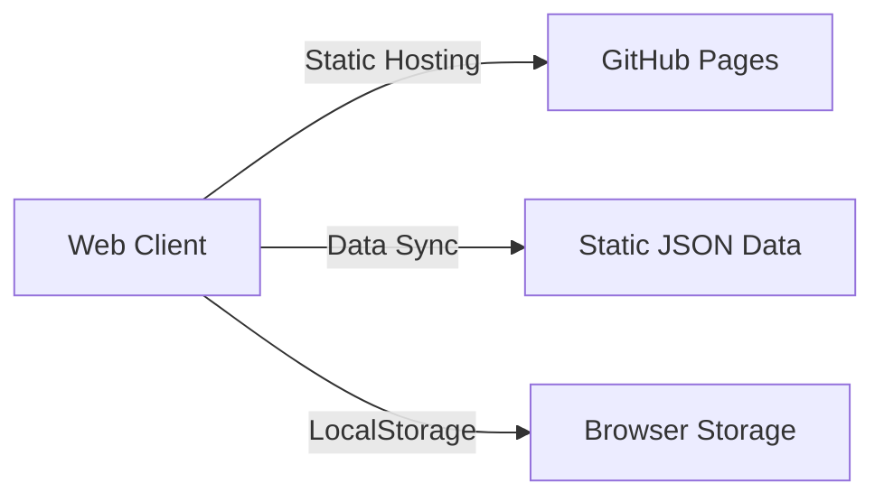

# 🌐 Global Lotto Proxy (Web App)

이 프로젝트는 동행복권의 당첨 정보를 제공하고 분석하는 현대적인 **웹 애플리케이션**입니다.  
기존 Python 데스크톱 앱에서 **모던 웹 앱(SPA)**으로 완전히 전환되었습니다.

## 🚀 배포 (Deployment)
**[👉 웹앱 바로가기 (GitHub Pages)](https://soulb.github.io/lotto-webapp/)**  
*(URL은 사용자 아이디에 따라 다를 수 있습니다.)*

## ✨ 주요 기능
- **번호 생성**: 가중치/스마트 모드, 연속수 제한, 고정/제외수 설정
- **AI 예측**: 몬테카를로 시뮬레이션 기반 번호 추천 시각화
- **통계 분석**: 번호대별 분포, 홀짝 비율, Hot/Cold 번호 분석
- **반응형 디자인**: 데스크탑(사이드바) 및 모바일(하단 탭바) 완벽 지원 ("Cosmic Luck" 테마)
- **오프라인 지원**: PWA 스타일의 로컬 데이터 관리 (즐겨찾기/히스토리)

## 🏗️ 아키텍처



- **Frontend**: Vanilla JS (ES Modules) + CSS Variables (No Build Step)
- **Deployment**: GitHub Actions -> GitHub Pages
- **Data**: 정적 JSON (`data/winning_stats.json`) + 로컬 스토리지

## 📁 프로젝트 구조

```
lotto - webapp/
├── index.html               # 메인 진입점
├── assets/                  # CSS, JS 소스
│   ├── app.js               # 핵심 로직 (Class 기반 모듈)
│   └── app.css              # 스타일 (Cosmic Luck 테마)
├── data/                    # 정적 데이터
│   └── winning_stats.json   # 당첨 정보
├── proxy/                   # (Optional) Cloudflare Worker 소스
├── backup/                  # 레거시 Python 앱 백업
└── .github/workflows/       # 배포 자동화 스크립트
```

## 📝 라이선스

[MIT License](LICENSE)
