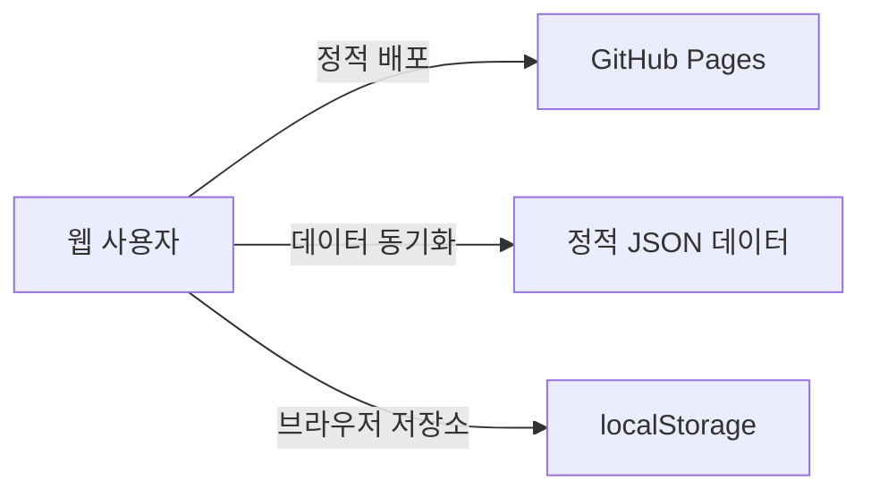

# 로또 6/45 프로 웹앱

이 프로젝트는 동행복권 당첨 정보를 조회, 분석하고 번호를 생성하는 웹앱입니다.
기존 파이썬 데스크톱 앱을 단일 페이지 웹앱으로 전환한 버전입니다.

## 배포 주소
- GitHub Pages: https://twbeatles.github.io/lotto---webapp/

## 최근 안정화 반영 (2026-03-01)
- 모듈 파싱 오류(`SyntaxError: Invalid or unexpected token`)로 앱 초기화가 중단되던 문제를 복구했습니다.
- 복구 대상: `DataManager`, `Ai`, `Backtest`, `Generator`의 깨진 문자열 리터럴.
- 서비스워커 캐시 버전을 `v7`로 상향해 배포 후 구버전 캐시 잔존 가능성을 낮췄습니다.
- 배포 직후 이상 동작 시 강력 새로고침(`Ctrl+F5`) 또는 사이트 데이터 삭제 후 재확인하세요.

## 주요 기능
- 번호 생성: 스마트 추천, 연속수 제한, 고정수/제외수 설정, QR 생성
- 티켓북/캠페인:
  - 생성 결과와 AI 결과를 회차 기준으로 티켓북에 저장
  - `N주 x 주당 M세트` 캠페인 생성으로 일괄 등록
  - 동기화 시 미정산 티켓 자동 정산
- 인공지능 예측:
  - 다중 전략(앙상블, 균형, 고빈도/저빈도 등) 지원
  - 몬테카를로 기반 정밀 시뮬레이션
  - 추천 조합별 근거 신호(빈도/최근성/공백/페어/필터) 표시
- 전략 시뮬레이션:
  - 단일/다중 전략 비교(최대 5개)
  - 수익률, 당첨률, 총비용, 총상금, 5등 이상 비교
  - 비교 결과 CSV 내보내기
- 통계 분석: 번호 구간 분포, 홀짝/고저 비율, 자주/드물게 나온 번호, 상위 동시출현 번호쌍
- 모바일 최적화 화면: 세이프 영역 대응, 하단 탐색, 반응형 레이아웃
- 알림 관리: 인앱 알림과 시스템 알림 설정
- 오프라인 앱 지원:
  - 네트워크가 없을 때도 기본 기능 사용 가능
  - 백그라운드 최신 데이터 동기화
  - 홈 화면 설치 지원
- 데이터 백업/복원: 백업 v1/v2/v3 가져오기, v3(`localUpdates`, `strategyPresets`) 내보내기
- 프록시 지원: `dhlottery.co.kr` 우회 및 사용자 프록시 주소 설정
  - 우선순위: `?proxyUrl/?proxy` -> `lotto_webapp_settings_v1.proxyLatestUrl` -> `lotto_pro_settings_v2.customProxy` -> 공용 기본값

## 구성 개요



- 화면/로직: 바닐라 자바스크립트(ES 모듈) + CSS 변수 (빌드 단계 없음)
- 배포: 정적 호스팅(GitHub Pages 호환)
- 데이터: 정적 JSON(`data/winning_stats.json`) + 로컬 저장소
- 서비스워커: 같은 출처 리소스 중심 캐시 전략 (`CACHE_VERSION: v7`)

## 프로젝트 구조

```text
lotto---webapp/
├── assets/                  # 정적 리소스(CSS, JS, 이미지)
│   ├── modules/             # 자바스크립트 모듈
│   │   ├── core/            # 앱/데이터/전략/UI 핵심
│   │   ├── features/        # 기능 모듈(예측/시뮬레이션/검증/통계 등)
│   │   └── utils/           # 공통 유틸리티
│   ├── icons/               # 앱 아이콘
│   ├── app.css              # 통합 스타일
│   ├── backtest.worker.js   # 시뮬레이션 워커
│   └── strategy.worker.js   # 생성/추천 워커
├── data/                    # 정적 데이터
│   └── winning_stats.json   # 로또 당첨 이력
├── proxy/                   # 프록시 워커 예시
├── scripts/                 # 로컬 점검 스크립트(perf/smoke)
├── index.html               # 앱 진입점
├── manifest.json            # 웹앱 설치 설정
└── sw.js                    # 서비스워커
```

## AI 핸드오프 기준 파일명
- 표준 문서: `claude.md`
- 호환 별칭: `cladue.md` (오탈자 호환용)
- 보조 문서: `gemini.md`

## 로컬 스모크 테스트

```bash
node scripts/smoke/smoke.mjs
```

성능 회귀를 함께 확인하려면:

```bash
node scripts/perf/bench.mjs
```

## 라이선스
- 현재 저장소에는 `LICENSE` 파일이 없습니다.
