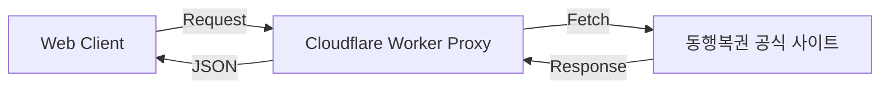

# 🌐 Global Lotto Proxy (Web App)

이 프로젝트는 동행복권의 당첨 정보를 제공하고 분석하는 현대적인 웹 애플리케이션입니다.  
기존 Python 데스크톱 앱에서 **Cloudflare Workers** 기반의 서버리스 프록시와 웹 클라이언트로 전환되었습니다.

## 🏗️ 아키텍처



- **Frontend**: (개발 예정 - React/Vite)
- **Backend (Proxy)**: Cloudflare Workers
    - `worker.js`: CORS 헤더 처리 및 업스트림 API 프록시
    - Endpoint: `/proxy/latest`

## 🚀 시작하기

### 1. 프록시 (Backend)

`proxy/` 디렉토리에 위치합니다.

```javascript
// 주요 엔드포인트
GET /proxy/latest?draw_no=1100
```

- **기능**:
    - CORS 문제 해결 (브라우저에서 직접 동행복권 API 호출 불가 문제 해결)
    - JSON 응답 포맷 표준화

### 2. 웹 클라이언트 (Frontend)

*(현재 개발 단계)*

## 📁 프로젝트 구조

```
lotto - webapp/
├── proxy/                   # Cloudflare Worker 소스 코드
│   ├── worker.js            # 메인 워커 스크립트
│   └── README.md            # 배포 및 설정 문서
├── backup/                  
│   └── legacy_python_v2.7.0 # 레거시 Python 앱 (참조용)
└── docs/                    # 기획 및 설계 문서
```

## 📝 라이선스

[MIT License](LICENSE)
