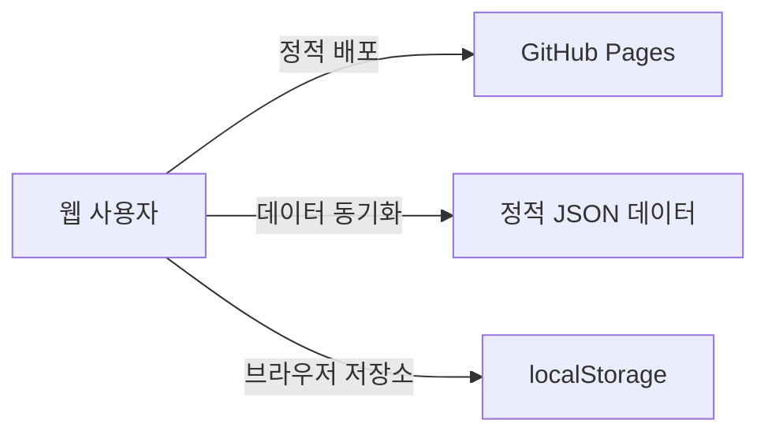

# 로또 6/45 프로 웹앱

이 프로젝트는 동행복권 당첨 정보를 조회, 분석하고 번호를 생성하는 웹앱입니다.
기존 파이썬 데스크톱 앱을 단일 페이지 웹앱으로 전환한 버전입니다.

## 배포 주소

- GitHub Pages: https://twbeatles.github.io/lotto---webapp/

## 최근 안정화/정합성 반영 (2026-03-16)

- 설정 모달 모바일 레이아웃을 단일 열 중심으로 다시 정리했습니다.
  - 가로 스크롤 제거
  - 패널/배지/버튼 폭 정리
  - 좁은 화면에서 설정 내용을 실제로 확인할 수 있도록 개선
- `예측`, `실험`, `확인` 탭의 lazy import 경로를 수정해 탭 전환 오류를 복구했습니다.
- 최신 회차 동기화 정책은 현재 `기본 자동 동기화 + 사용자 프록시 우선`입니다.
  - 사용자 프록시가 없으면 내장 fallback 경로로 최신 회차를 조회합니다.
  - 사용자 프록시가 있으면 해당 주소를 우선 사용합니다.
  - 동기화 결과는 `localUpdates`에 누적되어 정적 JSON보다 최신 회차를 로컬에서 보완할 수 있습니다.
- 설정 모달 안내 문구와 동기화 상태 표기를 현재 정책 기준으로 정리했습니다.
- same-origin Pretendard 폰트 경로를 바로잡아 런타임 폰트 로딩 경고를 줄였습니다.

## 최근 기능/오프라인 자산 통합 반영 (2026-03-13)

- 모바일 하단 탐색을 `gen/stats/ai/bt/check/data` 6탭으로 통일해 모바일에서도 `data` 화면에 직접 진입할 수 있습니다.
- 생성/AI/백테스트 화면에 전략 프리셋 CRUD를 추가했습니다.
  - 현재값 저장/불러오기/삭제
  - scope별 저장소 분리(`generator`, `ai`, `backtest`)
- AI 추천의 `생성 탭으로` 동작은 기존 생성 결과를 교체하는 정책으로 고정했습니다.
- 캠페인 삭제/전체삭제는 연결된 `campaignId` 티켓을 함께 삭제합니다.
- 최신 당첨결과 카드는 오프라인/데이터 없음 상태를 명시적으로 표시하며, 동기화 직후 현재 탭과 무관하게 즉시 갱신됩니다.
- 백업 Import 옵션에 `alertPrefs` 적용 체크를 추가했습니다.
  - 기본 정책: `Merge=theme/proxy/strategyPrefs/alerts 미적용`, `Overwrite=전부 적용`
- 런타임 외부 자산을 `assets/vendor/`로 로컬화했습니다.
  - 대상: `Pretendard`, `Phosphor Icons`, `qrcode`, `html2canvas`, `html5-qrcode`
  - 제3자 고지: `THIRD_PARTY_NOTICES.md`
- 서비스워커 캐시 버전을 `v10`으로 상향했습니다.
- 스모크 테스트에 회귀를 추가했습니다.
  - `campaign-cascade`, `requestNumbers replace`, `latest-win-placeholder`
  - `sync-latest-win refresh`, `import-alert-options`, `strategy-preset-crud`
  - `runtime-asset-localization`

## 최근 기능 개선 반영 (2026-03-14)

- 최신 회차 동기화 메타와 설정 모달 통합 UI를 도입했습니다.
  - 현재 기준 동기화 정책은 `기본 자동 동기화 + 사용자 프록시 우선`입니다.
  - 사용자 프록시가 없으면 내장 fallback 경로를 사용하고, 실패 시 정적 JSON + 로컬 업데이트 상태를 유지합니다.
- 설정 모달에 동기화 메타를 통합했습니다.
  - 현재 모드/소스, 마지막 성공 시각, 마지막 반영 회차, 마지막 실패 원인, 최신성 경고
- 데이터 관리 화면 리스트에 검색 + 페이지네이션을 추가했습니다.
  - 대상: 즐겨찾기, 히스토리, 티켓, 캠페인
  - 기본 페이지 크기: `20`
- 설정 모달에 저장 상태 요약과 권장 정리 경고를 추가했습니다.
  - 자동 삭제는 하지 않고, 백업/수동 정리를 유도합니다.
- 시스템 알림 UX를 정리했습니다.
  - 토글 on 시 즉시 권한 요청
  - 권한 배지/테스트 알림 버튼 추가
  - 정산 시점에는 권한 재요청 없이 허용 상태에서만 발송
- `pagehide`, `visibilitychange(hidden)`에서 즉시 저장 flush를 수행합니다.
- 서비스워커 업데이트는 사용자가 `업데이트`를 눌러 `skipWaiting`을 수락한 경우에만 reload합니다.

## 최근 구조/UX 리팩토링 반영 (2026-03-14)

- 생성 화면에서 저장 상태와 `localStorage` 관련 직접 노출을 제거하고, 전역 설정 모달로 이동했습니다.
- 설정 모달에서 아래 항목을 한곳에서 관리합니다.
  - 테마
  - 인앱/시스템 알림
  - 사용자 프록시 주소와 동기화 메타
  - 앱 저장 공간 사용량/정리 권장 상태
- 데이터 관리 화면은 백업/복원과 즐겨찾기/히스토리/티켓/캠페인 목록 중심으로 단순화했습니다.
- 핵심 JS는 퍼사드 + 내부 전용 모듈 구조로 분리했습니다.
  - `assets/modules/core/app`
  - `assets/modules/core/data`
  - `assets/modules/core/strategy`
  - `assets/modules/features/{ai,backtest,dataio,generator}`
- PWA 부트스트랩을 `assets/modules/bootstrap/pwa.js`로 분리했습니다.
- 스타일은 `assets/styles/*.css`로 분리하고 `assets/app.css`는 집계 엔트리로 유지했습니다.
- 스모크 테스트는 `scripts/smoke/helpers`, `scripts/smoke/cases` 구조로 분리했습니다.
- 서비스워커 캐시 버전을 `v11`로 상향했습니다.

## 최근 통합 개선 반영 (2026-03-05)

- 리포트 `1~9 + A~E` 권고사항을 한 번에 반영했습니다.
- 제한 상수를 `CONFIG.LIMITS`로 중앙화했습니다.
  - `MAX_BACKTEST_SPAN=300`
  - `MAX_CAMPAIGN_WEEKS=52`
  - `MAX_CAMPAIGN_SETS_PER_WEEK=20`
  - `MAX_CAMPAIGN_TOTAL_TICKETS=500`
  - `MAX_SYNC_FALLBACK_DRAWS=120`
- 백테스트 검증을 UI/메인 스레드/워커 3단계로 강화하고, `WINS` payload에 `matchedCount`, `bonusHit`, `hitText`를 추가했습니다.
- 백테스트 CSV를 `strategy_id`, `strategy_label` 분리 포맷으로 수정했습니다.
- 동기화를 단일 실행(single-flight)으로 고정하고, 수동 동기화에 한해 취소 버튼(`cancelSyncBtn`)을 지원합니다.
- QR 파서에 공식 host 화이트리스트와 중복 번호 거부 검증을 추가했습니다.
- 데이터 Import에 옵션 패널을 추가했습니다.
  - 모드: `merge` / `overwrite`
  - 설정 적용: `theme`, `proxy`, `strategyPrefs`
  - 기본 정책: `Merge=설정 미적용`, `Overwrite=설정 적용`
- 서비스워커 캐시 버전을 `v9`로 상향했습니다.
- 스모크 테스트에 회귀 4건을 추가했습니다.
  - `campaign-limit`, `qr-validation`, `ticket-dedupe`, `sync-guard`

## 개발 도구 정합화 반영 (2026-03-11)

- `package.json`, `package-lock.json`, `eslint.config.mjs`를 추가해 로컬 정적 검증 루틴을 명시했습니다.
- ESLint flat config를 도입했습니다.
  - 대상: `assets/**/*.js`, `proxy/**/*.js`, `scripts/**/*.mjs`, `sw.js`, `index.html`
  - `index.html`은 HTML 구조와 module 진입점 참조를 함께 검증합니다.
- Prettier를 개발 의존성으로 추가하고 VS Code 저장 시 ESLint auto-fix 설정(`.vscode/settings.json`)을 정리했습니다.
- 현재 기준 `npm run lint`가 통과합니다.

## 최근 안정화 반영 (2026-03-01)

- 모듈 파싱 오류(`SyntaxError: Invalid or unexpected token`)로 앱 초기화가 중단되던 문제를 복구했습니다.
- 복구 대상: `DataManager`, `Ai`, `Backtest`, `Generator`의 깨진 문자열 리터럴.
- 서비스워커 캐시 버전을 `v8`로 상향해 배포 후 구버전 캐시 잔존 가능성을 낮췄습니다.
- 배포 직후 이상 동작 시 강력 새로고침(`Ctrl+F5`) 또는 사이트 데이터 삭제 후 재확인하세요.

### 인코딩 정리 2차 (2026-03-01)

- 메인 상태 텍스트(`최신`, `업데이트 가능`, `오프라인`) 깨짐 현상을 복구했습니다.
- 생성/시뮬레이션/AI 탭의 토스트, 버튼 라벨, 로그 메시지, 접근성 라벨(`aria-label`)의 깨진 문구를 정리했습니다.
- 사용자 화면에서 보이는 한글 문구 기준으로 전역 점검을 수행했습니다.

### 기능 품질 강화 3차 (2026-03-01)

- 전략 엔진을 `엄격 필터 모드`로 고정했습니다. 필터를 만족하지 못하면 무필터 랜덤 조합으로 채우지 않습니다.
- 백테스트 워커의 무필터 랜덤 대체를 제거하고, 요약에 `requestedTickets/generatedTickets/fillRate`를 추가했습니다.
- 데이터 Import 완료 후 즉시 `fetchWinningStats -> updateLatestWin -> refreshCurrentRoute -> renderDataLists` 순서로 화면을 갱신합니다.
- 회차 정규화에서 `중복 번호`, `보너스 번호 중복`을 차단했습니다(`DataManager`, `backup` 공통).
- 캠페인 렌더링을 `textContent` 기반 DOM 조립으로 변경해 Import 경유 XSS 위험을 낮췄습니다.
- 서비스워커 precache에 `assets/modules/utils/backup.js`를 추가했습니다(`CACHE_VERSION: v8`).
- 스모크 테스트에 회귀 3건(엄격 필터, draw 정규화, post-import refresh 순서)을 추가했습니다.
- 코드베이스 텍스트 파일 UTF-8 디코드 점검 결과, 인코딩 오류 파일은 발견되지 않았습니다.

## 주요 기능

- 번호 생성: 스마트 추천, 연속수 제한, 고정수/제외수 설정, QR 생성
- 티켓북/캠페인:
  - 생성 결과와 AI 결과를 회차 기준으로 티켓북에 저장
  - `N주 x 주당 M세트` 캠페인 생성으로 일괄 등록
  - 안전 상한 적용: `최대 52주`, `주당 최대 20세트`, `총 500티켓`
  - 캠페인 삭제 시 연결 티켓 cascade 삭제
  - 동기화 시 미정산 티켓 자동 정산
- 인공지능 예측:
  - 다중 전략(앙상블, 균형, 고빈도/저빈도 등) 지원
  - 몬테카를로 기반 정밀 시뮬레이션
  - 추천 조합별 근거 신호(빈도/최근성/공백/페어/필터) 표시
  - 결과를 생성 탭으로 교체 가져오기 지원
- 전략 프리셋:
  - 생성/AI/백테스트별 저장·불러오기·삭제
  - 백업 v3의 `strategyPresets`와 같은 저장소 사용
- 전략 시뮬레이션:
  - 단일/다중 전략 비교(최대 5개)
  - 백테스트 범위 상한: 최대 300회차
  - 수익률, 당첨률, 총비용, 총상금, 5등 이상 비교
  - 비교 결과 CSV 내보내기
- 통계 분석: 번호 구간 분포, 홀짝/고저 비율, 자주/드물게 나온 번호, 상위 동시출현 번호쌍
- 모바일 최적화 화면: 세이프 영역 대응, 하단 탐색, 반응형 레이아웃
- 모바일 설정 모달: 단일 열 중심 레이아웃과 가로 오버플로우 방지
- 설정 모달:
  - 테마, 알림, 프록시, 동기화 상태, 저장 공간 요약을 한곳에서 관리
  - 좁은 화면에서 단일 열로 읽기 쉽게 배치
- 알림 관리: 인앱 알림과 시스템 알림 설정
  - 시스템 알림 권한 배지 및 테스트 알림 지원
- 오프라인 앱 지원:
  - 네트워크가 없을 때도 기본 기능 사용 가능
  - 앱 실행 중 백그라운드 최신 데이터 동기화(기본 자동 동기화, 사용자 프록시 우선)
  - 홈 화면 설치 지원
  - same-origin vendor 자산 기반으로 CDN 없이 런타임 동작
- 데이터 백업/복원: 백업 v1/v2/v3 가져오기, v3(`localUpdates`, `strategyPresets`) 내보내기
  - Import 옵션: `merge/overwrite` + `theme/proxy/strategyPrefs/alerts` 적용 체크박스
- 최신 회차 동기화/프록시 지원: `dhlottery.co.kr` 우회 및 사용자 프록시 주소 설정
  - 우선순위: `?proxyUrl/?proxy` -> `lotto_webapp_settings_v1.proxyLatestUrl` -> `lotto_pro_settings_v2.customProxy`
  - 프록시 미설정 시 앱은 기본 자동 동기화 fallback을 사용하고, 실패 시 정적 JSON + 로컬 업데이트 상태를 유지
  - 권장 입력 예시: `https://<worker>.workers.dev/proxy/latest`
  - 앱 URL에 `?proxyUrl=`로 직접 넣을 때는 프록시 주소 전체를 URL 인코딩하는 편이 안전합니다.

## 구성 개요



- 화면/로직: 바닐라 자바스크립트(ES 모듈) + CSS 변수 (빌드 단계 없음)
- 개발 도구: `npm` 스크립트 기반 ESLint/Prettier (배포 번들링 없음)
- 배포: 정적 호스팅(GitHub Pages 호환)
- 데이터: 정적 JSON(`data/winning_stats.json`) + 로컬 저장소
- 서비스워커: 같은 출처 리소스 중심 캐시 전략 (`CACHE_VERSION: v11`)

## 프로젝트 구조

```text
lotto---webapp/
├── assets/                  # 정적 리소스(CSS, JS, 이미지)
│   ├── modules/             # 자바스크립트 모듈
│   │   ├── bootstrap/       # PWA/앱 부트스트랩
│   │   ├── core/            # 퍼사드 + 내부 core 모듈
│   │   │   ├── app/         # 앱 라우팅/설정/데이터 리스트/최신 회차
│   │   │   ├── data/        # 저장/동기화/레코드/분석
│   │   │   └── strategy/    # 요청/컨텍스트/가중치/평가/생성
│   │   ├── features/        # 기능 퍼사드 + 내부 분리 모듈
│   │   │   ├── ai/
│   │   │   ├── backtest/
│   │   │   ├── dataio/
│   │   │   └── generator/
│   │   └── utils/           # 공통 유틸리티
│   ├── icons/               # 앱 아이콘
│   ├── styles/              # 분리된 스타일 조각
│   ├── vendor/              # 로컬 런타임 vendor 자산(font/icon/QR/캡처)
│   ├── app.css              # 스타일 집계 엔트리
│   ├── backtest.worker.js   # 시뮬레이션 워커
│   └── strategy.worker.js   # 생성/추천 워커
├── data/                    # 정적 데이터
│   └── winning_stats.json   # 로또 당첨 이력
├── proxy/                   # 프록시 워커 예시
├── scripts/                 # 로컬 점검 스크립트(perf/smoke)
│   └── smoke/               # helpers + cases + 엔트리
├── .vscode/settings.json    # VS Code 저장 시 ESLint auto-fix 설정
├── eslint.config.mjs        # ESLint flat config
├── index.html               # 앱 진입점
├── manifest.json            # 웹앱 설치 설정
├── package.json             # 개발 스크립트/의존성
├── package-lock.json        # npm lockfile
├── THIRD_PARTY_NOTICES.md   # 로컬 vendor 자산 고지
└── sw.js                    # 서비스워커
```

## AI 핸드오프 기준 파일명

- 표준 문서: `claude.md`
- 호환 별칭: `cladue.md` (오탈자 호환용)
- 보조 문서: `gemini.md`

## 로컬 스모크 테스트

먼저 개발 의존성을 설치합니다.

```bash
npm install
```

정적 검증:

```bash
npm run lint
```

필요 시 자동 수정:

```bash
npm run lint:fix
npm run format:check
```

```bash
node scripts/smoke/smoke.mjs
```

현재 `smoke`에는 아래 회귀 항목이 포함됩니다.

- `strict-filter`, `wheel-fixed`, `draw-normalization`
- `campaign-limit`, `campaign-cascade`, `campaign-empty-save`
- `qr-validation`, `qr-reentry-guard`
- `ticket-dedupe`, `requestNumbers replace`
- `sync-guard`, `sync-latest-win refresh`, `auto-sync fallback`
- `persistence-flush`, `notification-permission`, `data-list pagination`
- `import-alert-options`, `post-import-refresh`
- `strategy-preset-crud`, `runtime-asset-localization`
- `service-worker reload policy`

성능 회귀를 함께 확인하려면:

```bash
node scripts/perf/bench.mjs
```

## 라이선스

- 현재 저장소에는 `LICENSE` 파일이 없습니다.
