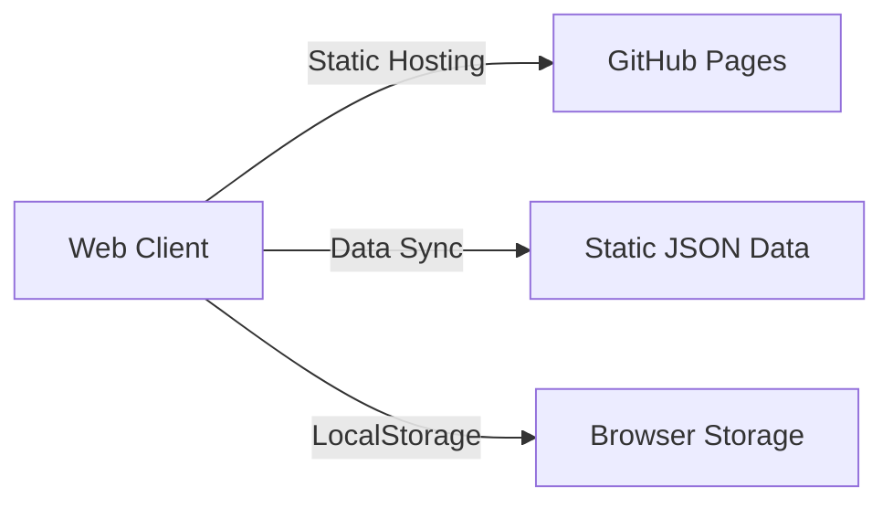

# 🌐 Global Lotto Proxy (Web App)

이 프로젝트는 동행복권의 당첨 정보를 제공하고 분석하는 현대적인 **웹 애플리케이션**입니다.  
기존 Python 데스크톱 앱에서 **모던 웹 앱(SPA)**으로 완전히 전환되었습니다.

## 🚀 배포 (Deployment)
**[👉 웹앱 바로가기 (GitHub Pages)](https://soulb.github.io/lotto-webapp/)**  
*(URL은 사용자 아이디에 따라 다를 수 있습니다.)*

## ✨ 주요 기능
- **번호 생성**: 가중치/스마트 모드, 연속수 제한, 고정/제외수 설정, **QR 코드 스캔 및 당첨 확인**
- **AI 예측 (New)**:
    - **다중 모델**: 앙상블(Ensemble), 패턴 밸런스(Pattern Balance), Cold/Hot 포커스 전략 지원
    - **정밀 시뮬레이션**: True Monte Carlo 알고리즘을 통한 10만 회 이상의 가상 시뮬레이션
    - **시각화**: AI Orb 애니메이션 및 직관적인 결과 카드 제공
- **통계 분석**: 번호대별 분포(색상 구분), 홀짝/고저 비율, Hot/Cold 번호 분석 (모바일 최적화 차트)
- **프리미엄 UI/UX**:
    - **Cosmic Theme**: 깊이감 있는 다크 모드와 세련된 라이트 모드 완벽 지원
    - **Glassmorphism**: 현대적인 블러 효과와 부드러운 인터랙션
    - **모바일 퍼스트**: 아이폰/안드로이드 Safe Area(100dvh) 완벽 대응 및 제스처 친화적 네비게이션
- **전략 시뮬레이션 (Backtest)**: **Web Worker** 기반 고속 백그라운드 연산 (수초 내 10년치 데이터 분석)
- **강력한 PWA**:
    - **오프라인 모드**: 인터넷 없이도 조회 및 생성 가능
    - **자동 동기화**: 앱 실행 시 최신 당첨 데이터 백그라운드 동기화
    - **설치 지원**: 홈 화면 추가 및 네이티브 앱과 동일한 사용성
- **데이터 관리**: JSON 파일 백업/복구, 중복 제거 알고리즘 적용
- **스마트 프록시**: `dhlottery.co.kr` 우회 및 커스텀 프록시 설정 지원

## 🏗️ 아키텍처



- **Frontend**: Vanilla JS (ES Modules) + CSS Variables (No Build Step)
- **Deployment**: GitHub Actions -> GitHub Pages
- **Data**: 정적 JSON (`data/winning_stats.json`) + 로컬 스토리지

## 📁 프로젝트 구조

```
lotto - webapp/
├── .github/workflows/       # [CI/CD] GitHub Pages 배포 자동화
├── assets/                  # 정적 리소스 (CSS, JS, Images)
│   ├── modules/             # [Core] JS 모듈 (ES6+)
│   │   ├── core/            # (App, Data, UI, MonteCarlo)
│   │   ├── features/        # (AI, Backtest, Stats, QR 등)
│   │   └── utils/           # (Helpers, Config)
│   ├── icons/               # [PWA] 아이콘 에셋
│   ├── app.css              # [Style] 통합 CSS (Cosmic Theme)
│   └── backtest.worker.js   # [Worker] 백테스트 연산 처리
├── data/                    # 정적 데이터
│   └── winning_stats.json   # [Data] 로또 당첨 이력 (Auto Update)
├── proxy/                   # [Serverless] Cloudflare Worker (CORS)
├── index.html               # [Entry] SPA 진입점
├── manifest.json            # [PWA] 웹앱 매니페스트
└── sw.js                    # [PWA] Service Worker (Offline Support)
```

## 📝 라이선스

[MIT License](LICENSE)
