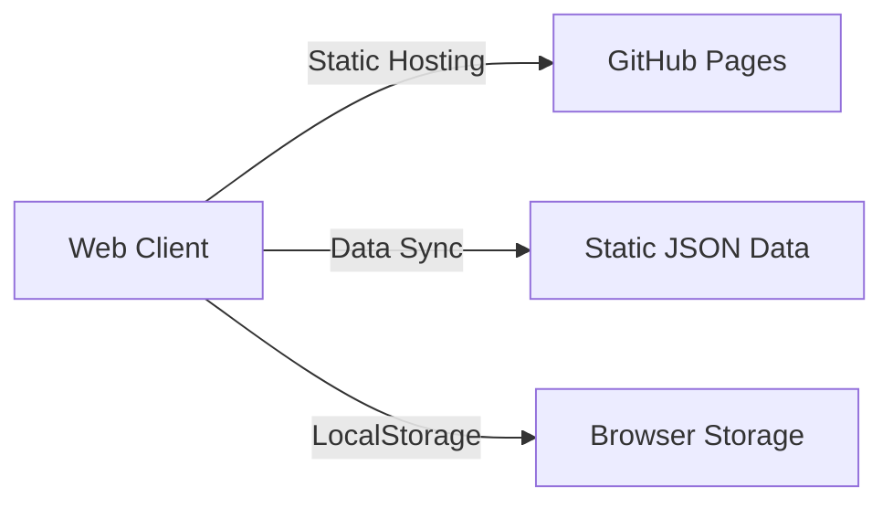

# 🌐 Global Lotto Proxy (Web App)

이 프로젝트는 동행복권의 당첨 정보를 제공하고 분석하는 현대적인 **웹 애플리케이션**입니다.  
기존 Python 데스크톱 앱에서 **모던 웹 앱(SPA)**으로 완전히 전환되었습니다.

## 🚀 배포 (Deployment)
**[👉 웹앱 바로가기 (GitHub Pages)](https://soulb.github.io/lotto-webapp/)**  
*(URL은 사용자 아이디에 따라 다를 수 있습니다.)*

## ✨ 주요 기능
- **번호 생성**: 가중치/스마트 모드, 연속수 제한, 고정/제외수 설정, **QR 코드 스캔 및 당첨 확인**
- **AI 예측 (New)**: 4가지 모델(앙상블, 패턴 밸런스, Cold/Hot 포커스) 선택 가능 & 몬테카를로 시뮬레이션 (결과 자동 저장)
- **통계 분석**: 번호대별 분포(색상 구분), 홀짝 비율(모바일 최적화), Hot/Cold 번호 분석
- **데이터 관리**: JSON 파일로 **백업 및 복구(Import/Export)** 지원, 중복 방지 병합
- **전략 시뮬레이션 (Backtest)**: **Web Worker** 기반 백그라운드 처리로 UI 끊김 없는 고속 시뮬레이션 (10년치 데이터도 수초 내 분석)
- **반응형 디자인**: 데스크탑(사이드바) 및 모바일(하단 탭바) 완벽 지원 ("Cosmic Luck" 테마)
- **모바일 최적화 (Finished)**: 통계 대시보드 밀집도 향상, 차트 시인성 개선, **아이폰/안드로이드 Safe Area 완벽 지원 (100dvh)**
- **강력한 PWA 기능**:
    - **스마트 데이터 동기화**: `NetworkFirst` 전략으로 최신 데이터 우선 확보 후 오프라인 백업
    - **앱 자동 업데이트**: 새로운 버전 감지 시 즉시 업데이트 알림 제공
    - **오프라인 모드**: 인터넷 연결 없이도 저장된 데이터로 일부 기능 사용 가능
- **스마트 프록시**: `dhlottery.co.kr` 전용 보안 프록시 및 커스텀 프록시 지원

## 🏗️ 아키텍처



- **Frontend**: Vanilla JS (ES Modules) + CSS Variables (No Build Step)
- **Deployment**: GitHub Actions -> GitHub Pages
- **Data**: 정적 JSON (`data/winning_stats.json`) + 로컬 스토리지

## 📁 프로젝트 구조

```
lotto - webapp/
├── .github/workflows/       # [CI/CD] GitHub Pages 배포 자동화
├── assets/                  # 정적 리소스 (CSS, JS, Images)
│   ├── modules/             # [Core] JS 모듈 (ES6+)
│   │   ├── core/            # (App, Data, UI, MonteCarlo)
│   │   ├── features/        # (AI, Backtest, Stats, QR 등)
│   │   └── utils/           # (Helpers, Config)
│   ├── icons/               # [PWA] 아이콘 에셋
│   ├── app.css              # [Style] 통합 CSS (Cosmic Theme)
│   └── backtest.worker.js   # [Worker] 백테스트 연산 처리
├── data/                    # 정적 데이터
│   └── winning_stats.json   # [Data] 로또 당첨 이력 (Auto Update)
├── proxy/                   # [Serverless] Cloudflare Worker (CORS)
├── index.html               # [Entry] SPA 진입점
├── manifest.json            # [PWA] 웹앱 매니페스트
└── sw.js                    # [PWA] Service Worker (Offline Support)
```

## 📝 라이선스

[MIT License](LICENSE)
